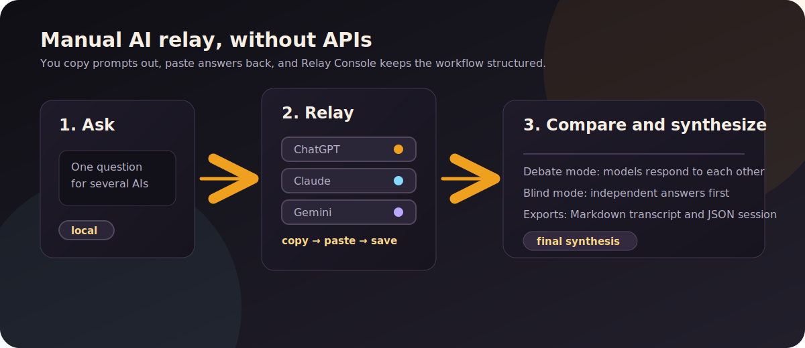

# Relay Console

**Relay Console is a local, offline, single-file HTML tool for manually relaying conversations between multiple AI assistants such as ChatGPT, Claude, Gemini, Perplexity, Copilot, Grok, DeepSeek, Mistral, Meta AI, Qwen, Kimi, Poe, or any custom chatbot.**

It helps you run a structured copy-paste relay: write one question, choose the assistants, copy a generated prompt into one chatbot, paste its answer back, then continue the conversation through the next model. Relay Console tracks the transcript, builds each turn's prompt, supports debate and blind-comparison modes, and helps merge the results into one final answer.

No API keys. No backend. No build step. No account. No server storage. You open the HTML file locally and you remain the wire between the models.

Project landing page: [lonelysoul87.github.io/relay-console/landing.html](https://lonelysoul87.github.io/relay-console/landing.html)

## What is this?

Relay Console is for people who already use several AI chatbots but do not want to pay again for API usage or wire models together through a hosted service.

Instead of automating the models, Relay Console structures the manual copy-paste workflow. It prepares the prompt for each assistant, includes the relevant prior context, tells each model its role and turn, preserves the full transcript, and helps synthesize the results.

Use it when you want ChatGPT, Claude, Gemini, Perplexity, Grok, DeepSeek, or other assistants to critique, compare, extend, or synthesize one another's answers, without giving Relay Console API access or remote storage.

## Quick start

1. Download the HTML file from the latest [release](../../releases).
2. Open it in any modern browser. That's it; there is nothing to install.
3. Write a question, pick which chatbots you're using, and start the relay.

Optionally, keep it as a bookmark or a local file for offline use.

## What Relay Console is not

- It does not call any AI API.
- It does not automate pasting into chatbot tabs.
- It does not inspect your browser tabs.
- It does not run a backend server.
- It does not upload your questions, answers, prompts, presets, or session data.
- It is not an autonomous agent framework.

If you want hands-off model automation, use an API-based orchestration tool. If you want a local, auditable, human-in-the-loop relay for consumer chatbot subscriptions, Relay Console is built for that.

## Who this is for

Relay Console is for people who:

- Pay for multiple consumer AI assistants and want them to critique or compare one another.
- Prefer manual review before each model sees the next prompt.
- Want a structured transcript instead of a messy series of copy-pasted chats.
- Do not want to set up API keys, server infrastructure, browser extensions, or automation scripts.
- Care about keeping the relay tool local, offline, and inspectable.
- Want to compare answers from several models before making a decision.

Relay Console is probably not for people who want fully automated multi-agent systems, background workers, autonomous browsing, API routing, or hosted team collaboration.

## Why manual relay?

Most multi-model tools assume API access. That works well for developers, but it is awkward for people who already pay for consumer chatbot plans and do not want separate API billing.

Relay Console takes the opposite path. It keeps the human in the loop and makes the copy-paste workflow structured, repeatable, and easier to audit. You decide what gets copied. You decide what gets pasted. You can trim context before forwarding it. You can stop or redirect the relay at any time.

The goal is not to remove the human from the loop. The goal is to make the loop less chaotic.

## Privacy and offline

Relay Console runs entirely in your browser. It loads no remote fonts, scripts, or trackers, and its Content-Security-Policy blocks remote subresources and programmatic network connections. The app never uploads your questions, answers, or session data. When you explicitly click **Copy & open**, the browser opens the provider homepage you configured; anything you then paste into that provider is handled under its own terms.

Autosave uses your browser's local storage, so your session survives a refresh when you run the saved file. Inside a sandboxed preview that storage may be blocked, so the **Save file** button is always there for a hard backup.

## Features

- **Quick-add chatbots.** Pick from a built-in list (Claude, ChatGPT, Gemini, Perplexity, Copilot, Grok, DeepSeek, Mistral, Meta AI, Qwen, Kimi, Poe) with the homepage prefilled, or add a custom one.
- **Two modes.** Debate, where each model sees the conversation and responds to it, or Blind, where each answers cold and a final pass synthesizes them.
- **Roles and reordering.** Give a model a job (skeptic, evidence checker, implementer) and set the running order.
- **Curated context.** Each answer keeps its captured original; you can trim or drop what gets forwarded to later models without altering the record.
- **Editable prompts** that persist per turn, with a live token estimate.
- **Presets.** Save a roster plus settings under a name and reload it in one click.
- **Collision-proof framing.** Quoted answers are fenced with a per-session token so pasted text can't break the prompt structure.
- **Response-format control.** Markdown, plain prose, or a verbatim code block (the reliable way to move a table between models).
- **Light and dark themes** that follow your system.
- **Markdown and JSON export/import**, plus first-run guidance for newcomers.

## How Relay Console compares

Relay Console is different from API agent frameworks because it does not call models programmatically.

It is different from browser extensions because it does not need to inspect, inject into, or automate chatbot tabs.

It is different from hosted AI workspaces because it has no backend account, server database, or remote relay service.

It is different from a plain text document because it tracks turns, roles, prompts, curated context, response format, exports, imports, and final synthesis in one structured workspace.

Relay Console is best understood as a manual AI relay console: a local tool that helps a person coordinate several AI assistants by hand.

## The chatbot list, and how it stays current

The built-in suggestions are a short, static array near the top of the source (`PROVIDERS`). Each entry is just a brand name, a stable homepage, and a color. They are editable suggestions, never authoritative config, so the worst case for a stale entry is a redirect you fix once in a text box.

To keep it from becoming a maintenance trap, the list follows four rules. If you open a pull request to add or change a provider, please keep to them:

1. Store brands, not model names or versions (those change monthly).
2. Use stable homepages (`https://claude.ai`), not deep paths (`/new`, `/app`).
3. Treat every value as an editable suggestion.
4. No logos, tiers, pricing, or "best for" blurbs.

## How this was built

Versions of this tool are critiqued by running questions through the tool itself: multiple models, in a relay, arguing about what to build or fix next. The release history is a record of that, including the round that caught the tool quietly phoning home to a font CDN, which is why it no longer does.

## Versioning

Each release is a self-contained file named by version (for example `relay-console-v1.8.4.html`). There is no upgrade step; download the new file. Saved sessions and presets from older versions import into newer ones.

## Support

I build local-first software projects, including Relay Console. If this tool saves you time or helps your workflow, you can support current and future development here:

[Support LonelySoul87 Projects on Ko-fi](https://ko-fi.com/lonelysoul87projects)

Support is optional. Relay Console remains free, offline, and usable without accounts, tracking, or paid features.

## Contributing

Issues and pull requests welcome, especially provider-list updates that follow the four rules above. Because the whole thing is one file with no build, a change is just an edit to that file.

Contributions require agreement to the [Contributor License Agreement](CLA.md), which lets the maintainer include your work in both the GPL and commercial editions while you keep ownership of it. See [CONTRIBUTING.md](CONTRIBUTING.md) for details.

## Security

Please report suspected security or privacy issues privately to [lonelysoul.projects@gmail.com](mailto:lonelysoul.projects@gmail.com) rather than opening a public issue. See [SECURITY.md](SECURITY.md).

## Commercial licensing

Organizations that need terms outside GPL-3.0-only can request a separate commercial license. See [COMMERCIAL-LICENSING.md](COMMERCIAL-LICENSING.md).

## License

Relay Console is dual-licensed.

- The public version is released under the **GNU General Public License version 3** (GPL-3.0-only). You may use, study, share, and modify it under those terms; see the [LICENSE](LICENSE) file. In short, if you distribute a modified version, you distribute it under the GPLv3 too.
- A separate **commercial license** is available from the copyright holder for anyone who wants to use Relay Console without the GPL's copyleft obligations (for example, inside a closed-source product). For terms, contact [lonelysoul.projects@gmail.com](mailto:lonelysoul.projects@gmail.com).

Copyright (C) 2026 LonelySoul87 Projects. "GPLv3 or commercial" means you choose: comply with the GPLv3, or obtain a commercial license. The maintainer holds copyright in the original code; contributors keep ownership of their own contributions but grant the maintainer the broad relicensing rights set out in the [CLA](CLA.md), which is what lets the project be offered under both licenses.
